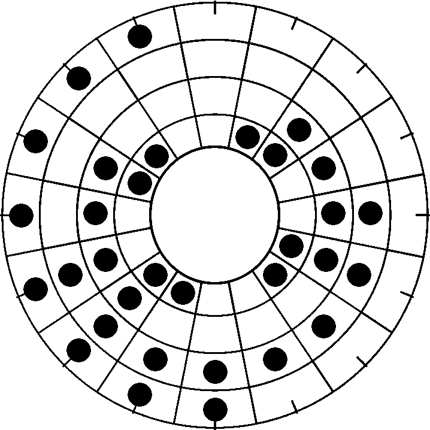
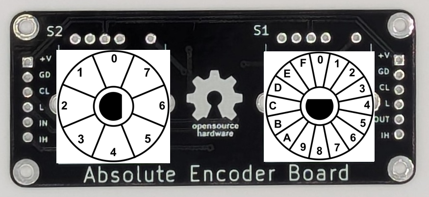
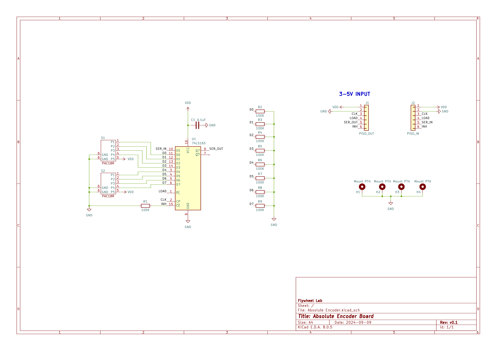
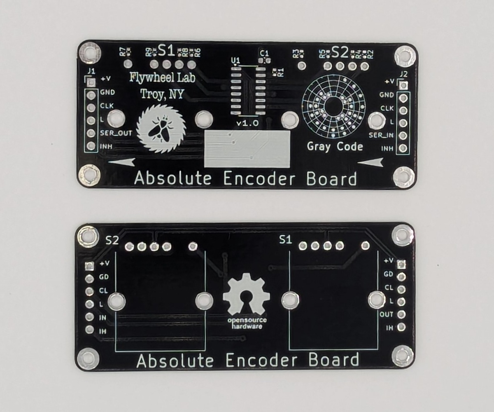
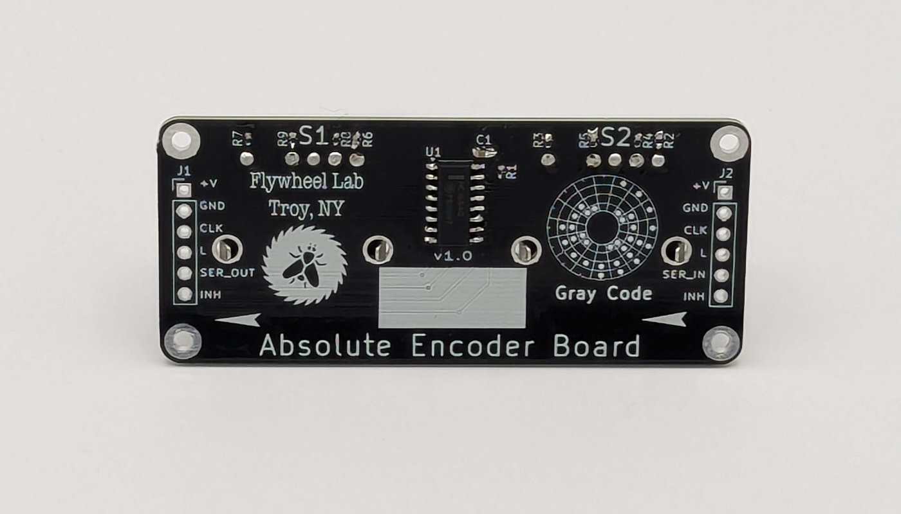
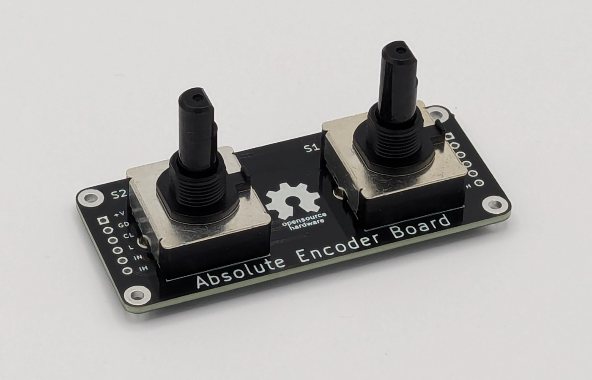

# Absolute Encoder Board
Welcome to the Open-Source Absolute Encoder Board Repository. Here you will find hardware designs and files that support the Absolute Encoder. The [GrayCode Arduino Library](https://github.com/biomurph/GrayCode) is available for installation via the Arduino IDE, just do a search for GrayCode in the Libraries Manager 

## What is it?
Encoders come in different types. Most people are familiar with [quadrature encoders](https://en.wikipedia.org/wiki/Incremental_encoder#Quadrature_outputs), which use two pins that change state sequentially in different order depending on the direction of rotation. One of the limitations of quadrature is that a microcontroller needs to be paying attention (usually with pin-change interrupts) in order to keep track of each step and count accordingly CW or CCW steps. In certain applications, the need for interrupts and constant attention to the encoder pin change can be limiting. Enter the Absolute encoder. This device can have 3 or more pins that maintain their coded state to show their rotational position. That means that any time you want to, you can read the encoder pins and get the correct positon without having to always keep track. Wikipedia has a great [Gray Code Page](https://en.wikipedia.org/wiki/Gray_code) for those who want to deep dive.

Why would you want an absolute encoder over a quadrature encoder?

- You are using a Raspberry Pi or other single board computer. These are powerful devices, but they run their software under an operating system which can make it hard to catch fast changes in a quadrature signal. All you need is one missed step to be off track. 
- You have encoder inputs but no room or overhead to provide the user dynamic feedback. Say you have a couple of dials on your project box, with a sticker or other static indicator of dial position. The absolute encoder will reliably report it's rotational position whenever asked, without having to keep track of dial movement.

Those two reasons are good enough for me! 

## How does it work?
The encoders in this project use [Gray](https://en.wikipedia.org/wiki/Gray_code) code, also know has Reflected Binary code. It was invented in order to avoid electro-mechanical glitches in rotary circuits. A rotary switch, for example that has 4 pins which output a binary coded decimal (BCD) may have more than one pin (bit) changing state during a transition between positions. This means that it can be possible to misread the rotational position at the transition point between rotational sections. With Gray code, only one bit is changed during each rotational transition, making it far more stable and resistant to glitches and bad readings. Here is a chart of Decimal, Binary, and Grey encoding.

Decimal  | Binary  | Gray
-------- | ------- | -----
0  | 0000 | 0000
1  | 0001 | 0001
2  | 0010 | 0011
3  | 0011 | 0010
4  | 0100 | 0110
5  | 0101 | 0111
6  | 0110 | 0101
7  | 0111 | 0100
8  | 1000 | 1100
9  | 1001 | 1101
10  | 1010 | 1111
11  | 1011 | 1110
12  | 1100 | 1010
13  | 1101 | 1011
14  | 1110 | 1001
15  | 1111 | 1000

Here's another rendering of the Gray code, arranged in a circle. This is the bit pattern of the dial, counting up when it is traveled clockwise.

## Hardware

The hardware is in prototype stage. I am using the [PAC18R](https://github.com/biomurph/Absolute_Encoder_Board/blob/main/assets/pac18r-2511013.pdf) Absolute Encoder from Bourns. They have a 5 pin output, 4 signal pins and 1 common pin, and come in 8 or 16 switch positions. These encoders have detents, which means they 'snap' into rotational position much like an old CRT television set knob does. The board design will carry 2 encoders and use a PISO shift register to read their positions. SW1 position data is in the low nibble, and SW2 data is in the high nibble. These boards can be daisy-chained, and the GrayCode library is designed to read off as many encoder boards as you have connected. The distance between the encoders is 35mm (1 3/8") on center.

### ENCODER SWITCH ORIANTATION

The PAC18R comes in 8, 12, and 16 position variants. I have not seen the 12 position switch widely available, but the GrayCode library will handle it if you come across one. The shafts on them are 6mm diameter and flatted D type. The flatted side, if you are relying on it, is positioned differently relative to the 0 (zero) position. Here's a diagram showing where the flatted position of the shaft is at position 0 for each switch relative to the PCB. 

 

**NOTE: The 12 position variant has the same flatted D orientation as the 16 position variant**

### PIN CONNECTIONS

There are 6 pins on each end of the board which allow for daisy-chaining mulitiple boards together. The Inhibit pin is pulled LOW  on the board, so you don't need to use it unless you need to use it (HIGH is Inhibit, LOW is Hibit). 
The pinout on the left edge is as follows:

Pin Name  |  Function
:--------:  |  :--------:
+V  |  Positive Voltage Input: 3V to 6V
GND  |  Connect to Voltage Ground
CLK  |  Shift Register Clock Pin
L  |  Shift Register Load Pin
SER_OUT  |  Shift Register Serial Out Pin
INH  |  Shift Register Inhibit Pin

The only difference with the pinout on the right edge is the SER_IN pin. When daisy-chaining, connect the +V, GND, CLK, L pins, and the SER IN of the first board to the SER OUT of the next board, and so on.

Here is the schematic

Here is a photo of the production ready prototype

Absolute Encocder Documentation © 2024 by Joel Murphy is licensed under [CC BY 4.0](https://creativecommons.org/licenses/by/4.0/?ref=chooser-v1)

