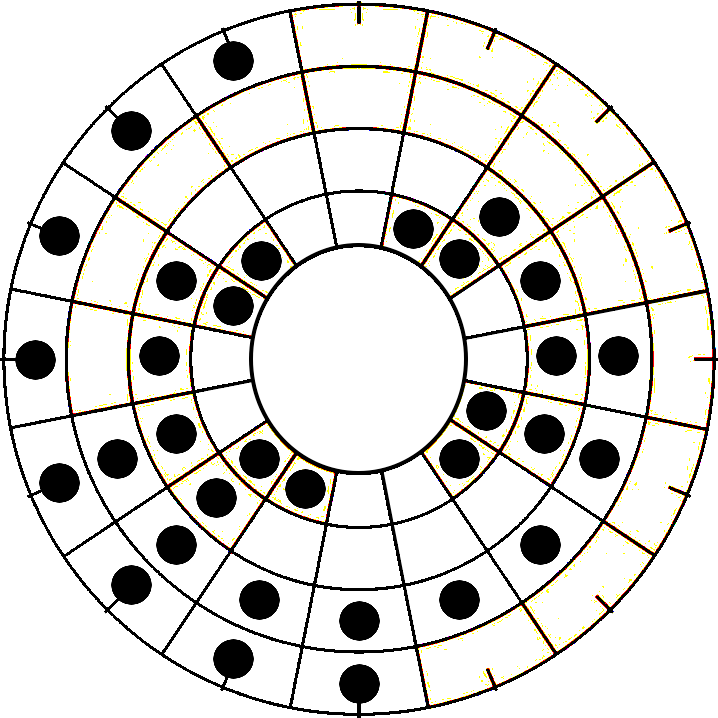
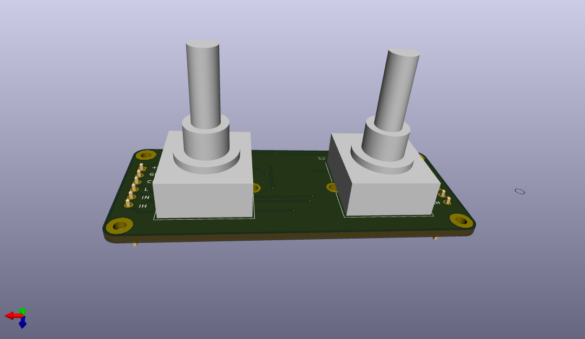
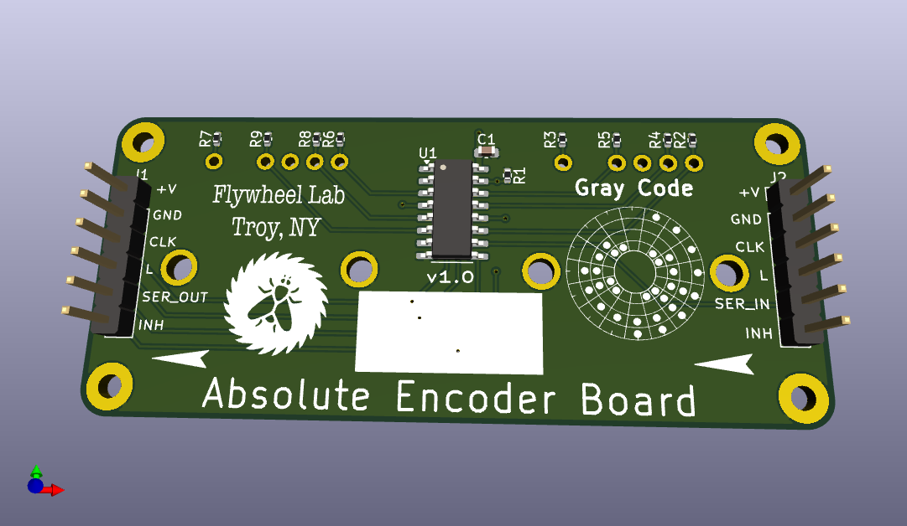

# GrayCode Encoder Board
Welcome to the Open-Source GrayCode Encoder Board Repository. Here you will find hardware and files that support the GrayCode Encoder. Here is a link to the [GrayCode Arduino Library](https://github.com/biomurph/GrayCode) which supports this hardware. 

## What is it?
Encoders come in different types. Most people are familiar with [quadrature encoders](https://en.wikipedia.org/wiki/Incremental_encoder#Quadrature_outputs), which use two pins that change state sequentially in different order depending on the direction if rotation. One of the limitations of quadrature is that a microcontroller needs to be paying attention (usually with pin-change interrupts) in order to keep track of each step and count accordingly CW or CCW steps. In certain applications, the need for interrupts and constant attention to the encoder pin change can be limiting. Enter the Absolute encoder. This device can have 3 or more pins that maintian their coded state to show their rotational position. That means that any time you want to, you can read the encoder pins and get the state withoug having to always keep track.

Why would you want an absolute encoder over a quadrature encoder?

- You are using a Raspberry Pi or other single board computer. These are powerful devices, but they run thier software under an operating system which can make it hard to catch fast changes in a quadrature signal. All you need is one missed step to be off track. 
- You have encoder inputs but no room or overhead to provide the user dynamic feedback. Say you have a couple of dials on your project box, with a sticker or other static indicator of dial position. The absolute encoder will reliably report it's rotational position whenever asked, without having to keep track of dial movement.

Those two reasons are good enough for me! 

## How does it work?
The encoders in this project use [Gray](https://en.wikipedia.org/wiki/Gray_code) code, also know nas Reflected Binary code. It was invented in order to avoid electro-mechanical glitches in rotary circuits. A rotoary switch, for example that has 4 pins which output a binary coded decimal (BCD) may have more than one pin (bit) changing state during a transition between positions. This means that it can be possible to misread the rotational position at the transition point between rotational sections. With Gray code, only one digit is changed during each rotational transition, making it far more stable and resistant to bad readings. Here is a chart of Decimal, Binary, and Grey encoding.

Decimal  | Binary  | Gray
-------- | ------- | -----
0  | 0000 | 0000
1  | 0001 | 0001
2  | 0010 | 0011
3  | 0011 | 0010
4  | 0100 | 0110
5  | 0101 | 0111
6  | 0110 | 0101
7  | 0111 | 0100
8  | 1000 | 1100
9  | 1001 | 1101
10  | 1010 | 1111
11  | 1011 | 1110
12  | 1100 | 1010
13  | 1101 | 1011
14  | 1110 | 1001
15  | 1111 | 1000

Here's another rendering of the Gray code, arranged in a circle. This is the bit pattern of the dial when it is traveled counter clockwise.

## Hardware

The hardware is in prototype stage. I am using the [PAC18R](https://github.com/biomurph/GrayCode_Encoder_Board/blob/main/assets/pac18r-2511013.pdf) Absolute Encoder from Bourns. They have a 4 pin output, and 16 switch positions. The board will carry 2 encoders and use a PISO shift register to read their positions. SW1 is connectec to the low nibble, and SW2 is connected to the high nibble. These boards can be daisy-chained, and the GrayCode library is designed to read off as many encoder positions as you have connected. 

Here is the schematic

Here are renderings of the design, done in KiCAD.

